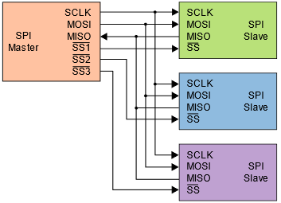
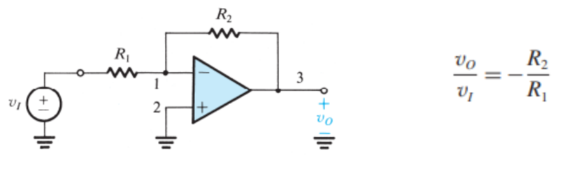
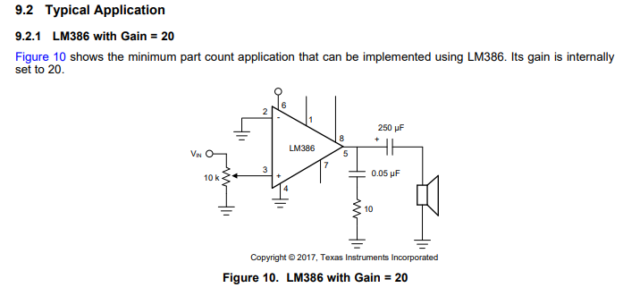
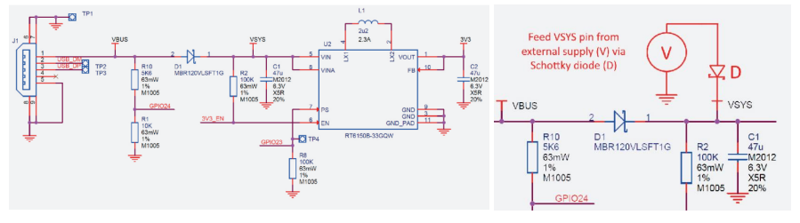
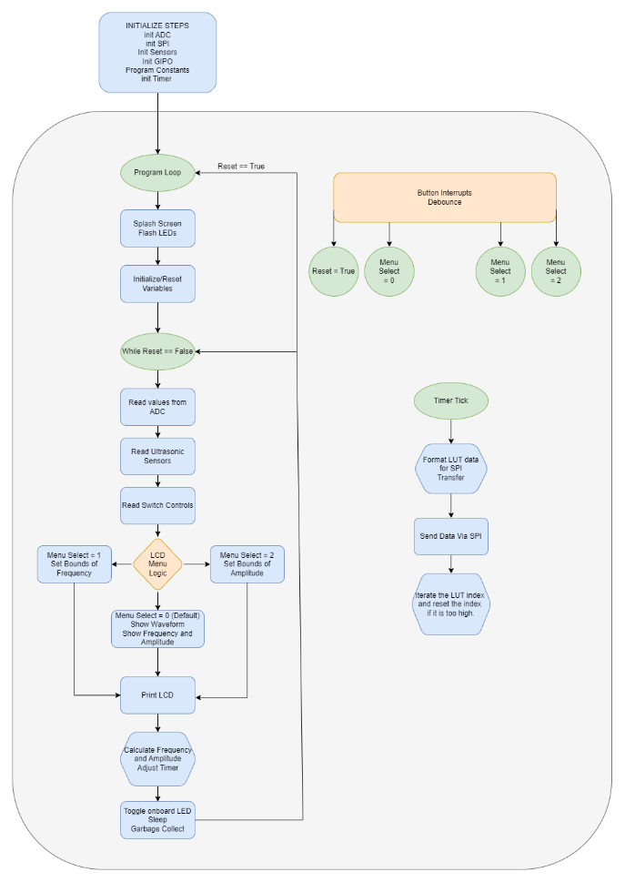
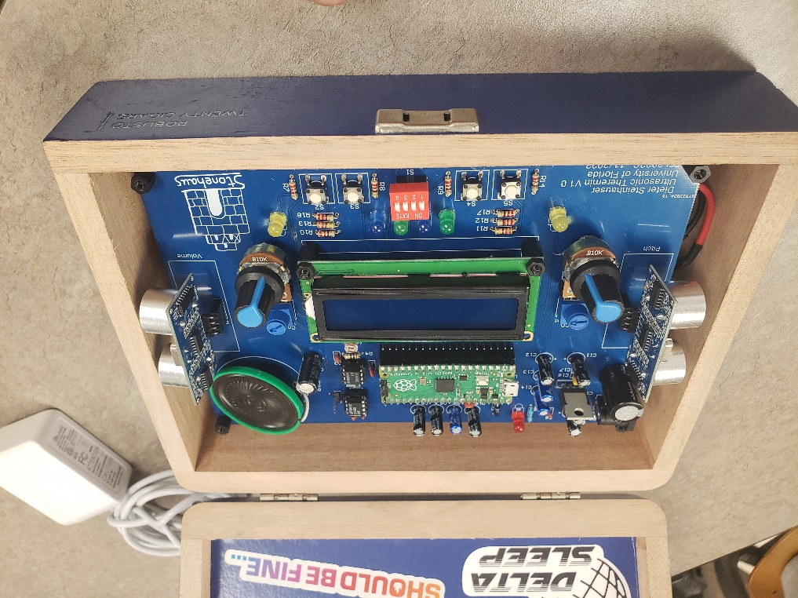

Ultrasonic Theremin - Junior Design
====================================================

Date: 11/2022

*******************
Introduction
*******************

The Theremin is a musical instrument designed by Leon Theremin in 1928. The device
operates using two antennas relying on capacitor physics, which sense the position of the
operator’s hands. One antenna influences the output frequency of the note, while the other
influences the volume of the note. While the original theremin operates on a series of analog
systems, I intend to implement similar systems in the digital domain by using the ultrasonic
sensors to determine distance between the instrument and the operator’s hands. The digital and
analog inputs will augment a waveform generator, which creates an audio signal according to the
user’s movements, creating a digital instrument.

******************
Methods
******************

Project Overview
------------------

The raspberry Pico interfaces with multiple components and generates waveform
functions for audio output. Ultrasonic sensors detect distance from the users’ hands for frequency
determination. Status of the device is displayed on an LCD. Switches and Buttons are available
on the device for interaction, selecting output waveforms and other menu options. Potentiometers
are connected to the Pico ADC for controlling the upper and lower boundaries of the frequency
range. LED’s will assist by lighting up when a boundary is hit.

All generated waveforms are sent to the DAC via SPI and then to the LM386 audio
amplifier, which drives the 8-ohm speaker. Everything can be powered using a 9V battery or
adapter, as 5V is generated using the LM2940 LDO. This powers most standalone components,
including the Pico. The SMPS on the Pico also generates 3.3V and is filtered for usage in GPIO.

Pico Overview
------------------

The Raspberry Pico is a development board with an RP2040 microcontroller chip. It has
264KB of SRAM and 2MB of flash memory. Development for the Pico is versatile as the
platform capable of being programmed in MicroPython, CPython, C, and Rust [15]_. The Pico has
a dual core processor capable of 133MHz clock speed, set to 125MHz out of the box. There are
40 GPIO pins on the board, with SPI, I2C, and UART communication capability. The Pico
comes equip with a 12-bit 500ksps ADC with 5 channels total. One channel is configured to an
RP2040 internal temperature sensor, and three are tied to GPIO pins on the Pico [16]_. The Pico
also has a timer with four alarms, a Real-Time-Counter (RTC), and sixteen Pulse-Width Modulation (PWM) channels

.. figure:: theremin_images/image001.png
  :align: center

  Figure 1: Raspberry Pico Pinout [15]_.

ADC Theory
------------------

Analog to Digital Converters are the primary method of capturing analog data using a
microcontroller. ADC’s capture analog signals such as sound or light waveforms and convert
them to a digital signal for processing of information. An ADC takes continuous magnitude data
from a continuous time domain into discrete magnitude data in a discrete time domain [3]_. The
conversion quantizes the signal based on the resolution, reference voltages, and sample rate of
the ADC, introducing small errors into the signal as noise.

.. figure:: theremin_images/image002.png
  :align: center

  Figure 2: Quantization of an Analog to Digital Converter on a sine wave.

Resolution and reference voltages of an ADC produces quantization errors within the
amplitude domain of a signal, where the sample rate of an ADC produces quantization errors
within the time domain. Resolution gives the number of discrete values an ADC can produce,
where the reference voltages provide the span of voltages the ADC can receive as a signal.
Ground is often defaulted to the lower reference voltage to simplify ADC implementation. As a
result, the voltage resolution in volts per bit is given as the span between the reference voltages
divided by the number of discrete values the ADC resolution can produce. The digital code made
by the ADC multiplied by the voltage resolution of the ADC will return the voltage recorded by
the ADC. Quantization produces rounding errors in the approximation of the analog voltage,
which is worsened by noise and jitter that exists on the signal prior to the ADC conversion.
Signal noise can significantly reduce the effective number of bits to which an ADC is accurate.

.. figure:: theremin_images/image003.png
  :width: 400
  :align: center

  Figure 3: ADC formulas.

Sample rate of an ADC produces quantization errors within the time domain of the
signal. The sampling rate of an ADC should ideally greater than twice the highest frequency
being recorded, otherwise aliasing will occur. Aliasing can also be mitigated by adding a low-pass
filter to the ADC input, removing frequencies above half of the sampling frequency.
Oversampling is also commonly employed as it can reduce noise and improve bit-depth.

ADC Configuration
------------------

Since the ADC in on the Raspberry Pico, initial setup of the ADC can easily be achieved
using the ADC section of the Pico Software Development Kit (SDK) [16]_. This provides the
engineer with a simple and straightforward introduction on taking ADC readings. However, the
12-bit ADC onboard the Pico is not great by any means. This is due to the switching power
regulator on the Pico. As a result of switching signal noise, the onboard voltage reference for the
ADC is setup in poor conditions. The ADC has a 30mV offset and its signal is quite noisy [15]_.
The datasheet gives suggestions on improvement of the ADC readings. An External reference
voltage may be used, the R7 resistor can be removed, or issues can be mitigated in averaging and
offset code. I chose a different route entirely, by adding bypass capacitors to the reference
voltage and ADC input pins for filtering and smoothing. This is enough for the applications of
this project.

SPI Theory
------------------

SPI is a full-duplex serial communication protocol that was created by Motorola in the
1980’s for high-speed communication in embedded systems [18]_. The SPI protocol consists of a
single master device and one or many slave devices. For a simple two device system, A clock
(SCLK), a chip select (CS), and two data lines (MOSI, MISO) are employed. MOSI is the data
transmitted from the master device, while MISO is the data received from the master device.

  Figure 4: SPI configuration for a two-device system [5]_.

SPI can incorporate multiple slave devices by connecting data and clock lines,
individually accessing a slave device by using a dedicated chip select line for each device as seen
in figure 5. This can become GPIO intensive as the number of pins needed on the master device
will increase with each additional slave device. Alternatively, SPI devices can work
cooperatively by tying all chip selects to the same line as seen in figure 6. This works well if data
does not need to be returned from the slave devices and the slave devices are intended to have
the same output.

..  |fig6| image:: theremin_images/image006.png
           :width: 320

.. list-table::
   :header-rows: 0

   * - |fig5|
     - |fig6|
   * - *Figure 5: SPI independent configuration* [5]_.
     - *Figure 6: SPI daisy-chained configuration* [5]_.

SPI transmits and receives data simultaneously in both directions, making the
communication full duplex in design. SPI also uses GPIO for addressing a chip instead of
transmitting addresses over the data lines commonly seen in I2C. Because of the full duplex data
transmission and GPIO addressing, SPI has very high transmission speeds, but can become
GPIO intensive. In practice, the maximum clock speeds of a SPI configuration depend highly on
the connected devices and their method of connection. Finally, the SPI protocol is highly
configurable in that the clock polarity and phase can be configured. This is also highly dependent
on connected devices and should be considered when creating a two-device or multi-device
system. In terms of using SPI on the Pico, A clock at or below 1MHz is best for breadboarding
and flywire use.

DAC Theory
------------------
A Digital to Analog Converter operates on much of the same principles of an ADC but in
reverse. DAC’s take a digital code that is within the resolution range of the device and output an
analog waveform. Uses for DAC’s are often found in creating audio and video signals [5]_. A
DAC will have a singular or pair of voltage references and a bit resolution for characterizing the
precision and range of the output waveform. An output voltage can be calculated by dividing a
given code by the number of discrete values the DAC can produce. This is then multiplied by the
reference voltage to return the ideal output voltage.

.. figure:: theremin_images/image007.png
  :width: 400
  :align: center

  Figure 7: DAC formulas.

DAC’s have some non-idealities in the form of differential and integral non-linearity,
which characterize the difference between two adjacent code values and the difference in the
transfer characteristic, respectively.

DAC Configuration
------------------

The LTC1661 from Linear Technology hosts two 10-bit DAC’s that are addressable via
SPI [3]_. Communication is configured with the SPI clock idling low and capturing data on the
rising edge of the clock. Simple initialization of SPI on the Pico can be seen chapter 3.7 the
MicroPython SDK [16]_. For an in-depth approach to SPI initialization and communication on the
Pico, the MicroPython documentation for the SPI module proved insightful [14]_. The maximum
baud rate of the LTC1661 is 10MHz [12]_. I employed a baud rate of no larger than 8MHz to
avoid data corruption on the breadboard. However, small distances of SPI connections on the
final PCB make higher speeds possible. The default SPI pins of the Pico were employed, located
the bottom right corner of the Pico Pinout [15]_.

.. figure:: theremin_images/image008.png
  :align: center

  Figure 8: Timing Diagram of LTC1661 SPI communication [12]_

Communication with this DAC is slightly more complicated due to the 10-bit resolution
associated with the device. Commanding the device to write to its internal register and Update is
the primary functionality desired for this module. Knowing this, the commands 0x9 or 0xA
would be applicable for continuously changing voltage on output A and B respectively [12]_

.. figure:: theremin_images/image009.png
  :align: center

  Figure 9: SPI communication Sequence for the LTC1661 [12]_.

In our program, we must parse the data for every transmission so that a word packet sent will
have the format seen in figure 9. The LTC1661 sends the command, then splits the data bits
between the two bytes, followed by don’t cares to fill the word packet. In an 8-, 12-, or 16-bit
DAC, less bit manipulation is required.

Operational Amplifier Theory
-----------------------------

Operational Amplifiers (Op-Amps) are high-gain voltage amplifiers with differential
input and a single voltage output. Op-Amps typically have five terminals: An inverting input,
non-inverting input, an upper supply, a lower supply, and an output. An ideal Op-Amp has an
infinite input resistance and zero output resistance. As a result, input terminals see zero current.
Input terminals also see equivalent voltages. Lastly, ideal op-amps experience infinite open-loop
gain and infinite Gain Bandwidth (GBW).

.. figure:: theremin_images/figure10.png
  :align: center

  Figure 10: Anatomy of an Op-Amp and Ideal Op-Amp Equations [1]_.

Using an infinite open-loop gain is limiting, as the output voltage signal would become
saturated immediately. This could be useful in a comparator circuit. However, for most purposes
some form of negative feedback is implemented to create a closed loop gain within the
boundaries of the supply rails. Negative feedback amplifiers come in inverting (Figure 11) and
non-inverting (Figure 12) configurations, with gain determined by the ratio of resistances seen by
the negative feedback loop.

  Figure 11: Inverting Op-Amp configuration and voltage gain equation [1]_.

.. figure:: theremin_images/figure12.png
  :align: center

  Figure 12: Non-inverting Op-Amp configuration and voltage gain equation [1]_.

Non-idealities of real-life Op-Amps will also affect the circuit, the most influential of which is
determined by a given IC’s strengths and weaknesses. A notable non-ideality can be seen in gain
bandwidth and subsequent frequency response. Finite GBW/GBP of an Op-Amp produces
attributes of an active lowpass filter. With the lower cutoff frequency determined by the GBP
divided by the gain of the circuit [7]_. As a result, open-loop response often has high gain with
very low cutoff frequency. Whereas closed-loop gain will keep gain approximately constant for a
much wider bandwidth.

  Figure 13: LM741 Frequency response in open and closed loop configurations [9]_.

.. figure:: theremin_images/image022.png
  :align: center

  Figure 14: Gain Bandwidth formula [9]_.

Other non-idealities of Op-Amps are limits on output current, voltage, and slew rate.
Output voltage can become saturated due to voltage gain exceeding the supply rails. Current
supplied by an Op-Amp IC is highly dependent on a model, and current limits may be imposed
for safety of the internal circuitry. The maximum rate of change for an Op-Amps output voltage
is referred to as its slew rate. Op-Amps are slew rate limited at frequencies of operation that
require a faster rate than the IC can permit.

First-Order Filter Theory
---------------------------

Analog filters are a method of reducing gain of responses at certain frequencies. First-order
filters implement a singular cutoff frequency while second order filters implement multiple
cutoff frequencies. Filters can be implemented in active and passive configurations, meaning
with and without Op-Amps respectively. Regardless of a filter being passive or active, Filter
frequencies and modes of operation are created between RL and RC components. Figure 15
implements passive and active filters in multiple filter configurations.

.. figure:: theremin_images/image023.png
  :align: center

  Figure 15: First order filter table with active and passive applications [1]_.

Audio Amplifier Configuration
------------------------------

The audio amplifier circuit has a simple implementation. The primary goal was creating a
circuit with 26dB gain (20V/V) using the LM386. This was easily accomplished by referring to
the LM386 datasheet as they provide applications in section 9 of the document (Figure 16) [11]_.
Implementation can be seen on the schematic, Figure 22. I made no changes to the circuit
recommended by the datasheet.

  Figure 16: LM386 Wiring Diagram for a gain of 20 [11]_.

Power Regulation and Filtering
--------------------------------

To supply power to the system, I chose to use the LM2940 5V low-dropout regulator.
This allows for a 9-12V DC source to supply the devices without much overhead. This provided
a smooth 5V source for most components, with local decoupling capacitors where needed. The
LM2940 is a prime candidate for 5V regulation as its implementation is simple, only requiring
two capacitors on the Vin and Vout [10]_. I implemented an array of values for the output
capacitors out of an abundance of safety and a desire for a highly filtered power source [2]_, [4]_, [20]_.

.. figure:: theremin_images/image025.png
  :align: center

  Figure 17: LM2940 LDO Wiring Diagram [10]_.

In addition to the 5V source, I powered the Raspberry Pico via the VSYS node to activate
the device and use the 3.3V Switching Mode Power Supply (SMPS). This was done using a
Schottky diode from 5V to VSYS to avoid backflow when the Pico is plugged in via USB [15].
The Pico power-chain is good because the SMPS is efficient, but noise on the output causes
problems with other systems like the ADC [15]_, [16]_. As a result, I added bypass capacitors to this
source as well.

  Figure 18: Pico Power-chain and the implemented method of external supply [10]_.

Inputs and Outputs
------------------

Buttons, switches, and LEDs are integrated into the design for various controls and
system status. All inputs are setup in a pull-down configuration. Wave selection is controlled by
the active switches while both menu selection and software resets are controlled by the buttons.
This allows for a robust interface system to be implemented in software. GPIO selected for these
pins were selected last to ensure critical systems had placement. Button debouncing was taken
care of in software by implementing a delay after initial triggering. Alternatively, these buttons
could be debounced using small bypass capacitors such as a 100nF, creating a linear voltage
response for the IO pin instead of a bouncing signal. All buttons, switches, and output LED’s use
the 3.3V source from the SMPS as to not damage GPIO pins on the Pico. They are also paired
with 220-ohm resistors to give the LED’s maximum brightness in a safe current range.

Ultrasonic Sensors
-------------------

The HC-SR04 is an Ultrasonic sensor module that uses sonar to determine distance of
objects similar to echolocation seen in animals like bats or dolphins [8]_. It is rated for distances
of 2cm to 400cm and can provide high accuracy within this range. The sensors have four
connections, VCC, Trig, Echo, and GND. The device operates with a 5V supply, while the
trigger and echo are used to communicate digital data between the sensor and a microcontroller.

From the microcontroller, the Trig pin is set high for 10uS then brought low. This tells
the sensor to send eight 40kHz bursts from the transmitter. The microcontroller should then poll
the Echo pin, waiting for a high signal from the receiver, indicating the return of the bursts echo.
The time between the rising and falling edge of the Echo pin can be used to calculate distance
based on the speed of sound, 343 m/s. Based on the distances calculated from each sensor, we
can modify output sound data.

  Figure 19: Ultrasonic sensor timing diagram [8]_.

LCD Configuration
------------------

Configuration of the Crystal Fontz AH1602Z-YYH for parallel communication was a
major step in setup of this circuit. I chose to use parallel communication to interact with the LCD
as opposed to SPI or I2C for simplicity and use of previous code. The LCD is wired in parallel to
the microcontroller with four-bit communication [19]_. A potentiometer was connected for
contrast control of the LCD, and a photoresistor and 1k-ohm resistor was connected in parallel
for adaptive brightness control. For parallel communication, a nibble of data is sent to the display
simultaneously. Full bytes of data are then sent to the device in a process called bit-banging. This
splits a byte of data to send two nibbles in series, communicating the upper four bits and then the
lower four bits. For wiring of the device, previous lecture slides and LCD driver manual were
helpful in wiring and debugging issues with contrast and brightness [19]_.

Theremin Circuit Configuration
-------------------------------

The various components are connected in a circuit following the hardware diagram and
schematics seen below. 9V Power is connected via a barrel jack and regulated to 5V, supplying
the Pico through a Schottky diode. An LED is also driven by the 5V rail to indicate a power on
status and a switch is present to cut off the 9V power to the circuit entirely. The 3.3V output of
the Pico is used for all buttons, switches, and output LEDs. Two potentiometers are connected
between 3.3V and ground with the wiper connecting to ADC pins, allowing variable analog input
to the system. Switches, Buttons, and output LEDs are 3.3V pull-downs available for menu and
waveform controls.

The DAC and audio amplifier are connected in series, followed by an 8-ohm speaker,
presenting the Analog output waveform. Another potentiometer was connected between the
DAC and amplifier to provide a coarse volume control on the output. Digital output in the form
of Status LEDs indicate continuous operation by toggling and display on reset of the device.

  Figure 20: Hardware Block Diagram of the Theremin Circuit.

A single processor flow was employed for reliability and simplicity. To help speed up
operations, a generous overclock was applied, setting the system clock to 270MHz. The Pico
would start by initializing SPI communication at 10MHz, LCD parallel communication, and
Ultrasonic sensor communication. This was followed by all other GPIO initialization, definition
of button interrupts, and creating the waveform generation process in the timer tick.

The Pico would then enter its program loop, where a startup splash screen would be
displayed along with lighting all LEDs. All variables would also be set to their default state.
Pressing the reset button would return the user to this point in the program.

The main loop would then be entered and would continue until the reset button is pressed.
In this process, the ADC, ultrasonic sensors, and switches are all polled for data. Depending on
the state of the display menu set by button interrupts, the ADCs could set the frequency or
amplitude range for computation later. The LCD prints a display associated with the current
menu state. If both sensors detect the hands of the user, frequency and amplitude is then
calculated based on the current boundaries for each and the ultrasonic sensor data. The timer is
then started or adjusted for frequency shifts, and the processor sends SPI data to the DAC for
output. If the sensors do not detect objects or a waveform is not selected with a switch, sound
will not be output. Lastly, the onboard LED is toggled and the loop restarts for the duration of
instrument use.

  Figure 21: Software Block Diagram of the Theremin Circuit.

Schematic and PCB Design
-------------------------

All previously mentioned components must be compiled into a schematic design for
wiring structure and PCB design. Useful tips and tricks for understanding the Altium can be
learned by watching Professor Stapleton’s videos [13]_.

The most useful design points are regarding power and capacitor placement. Bypass and
decoupling capacitors are added to the board for several reasons. First, capacitors can be used on
power headers to avoid voltage spikes and removing AC ripple on DC power. Small ceramic
caps offer low series resistance and react fast but have a difficult time dealing with substantial
amounts of charge over long periods. Polarized electrolytic capacitors usually have a much
higher capacitance, and in conjunction with smaller ceramic capacitors, effectively clean DC
voltage [2]_, [13]_. In larger schematics and PCB’s, we are not always able to position circuits near
bypass capacitors. Therefore, small decoupling capacitors are recommended for placement near a
circuit subsection to help clean AC ripple from DC voltages [4]_.

Once the schematic was populated with all necessary circuit components, the PCB was
updated with all schematic components for board layout. A general layout of parts was done
before resizing the board outline to find the most effective use of space. When all components
have found their relative placement, routing traces for components using auto-routing tools or
manually is required. I chose to auto-route, followed with manual edits to correct some trace
routes. I found 20mil routes were sufficient for this circuit. Copper pours are also recommended
for adding a ground or Vcc layer to the PCB, further simplifying routing design and common
routes. I implemented a Ground and 5V layer using the copper pours.

.. figure:: theremin_images/image031.png
  :align: center

  Figure 22: Ultrasonic Theremin schematic page 1 of 2.

.. figure:: theremin_images/image032.png
  :align: center

  Figure 23: Ultrasonic Theremin schematic page 2 of 2.

.. figure:: theremin_images/image033.png
  :align: center

  Figure 24: Top side of Ultrasonic Theremin PCB layout.

Bill Of Materials
---------------------

.. csv-table:: Bill Of Materials
   :file: theremin_images/BillOfMaterials.csv

******************
Results
******************

The schematic of the circuit and PCB turned out well, with minimal errors. The
assembled PCB was easy to debug because of its plentiful headers employed in the diagram.
Also, using female headers for the ultrasonic sensors, LCD, DIP packages, and potentiometers
aided debug and ensured that any errors in design could be more easily fixed if the PCB was
routed wrong. Thankfully, there were no design breaking errors in this circuit, and most
components worked immediately after installation.

  Figure 25: Empty Theremin Circuit PCB.

.. figure:: theremin_images/image036.jpg
  :align: center

  Figure 26: Populated Theremin Circuit PCB.

Power
---------------------

The power regulation and filtering produced a 5V source with minimal noise, observed
with as little as 10mV ripple on the source. Extra filtering on the 3.3V source also seemed
fruitful but may benefit from a larger array of capacitances to further smooth the ~30-40mV
ripple observed on the device pin. This is a slight improvement on the unfiltered 3.3V rail.

.. figure:: theremin_images/image037.jpg
  :align: center

  Figure 27: Power regulation system on the PCB

.. figure:: theremin_images/image038.png
  :align: center

  Figure 28: 5V source observed on the oscilloscope.

.. figure:: theremin_images/image039.png
  :align: center

  Figure 29: 3.3V source observed on the oscilloscope.

Audio
---------------------

The audio system of this circuit had no issue driving the 8-ohm speaker for a variety of
32-step waveforms. The coarse volume potentiometer helped easily remove clipping from the
amplifier stage. Frequencies of 160Hz were achievable with system stability. Frequencies up to
240 were achieved using this audio configuration, however this boost is audio transaction
demand.

Without Speaker Load
*********************

.. figure:: theremin_images/audio.jpg
  :align: center

  Figure 30: Audio output system.

.. figure:: theremin_images/image040.png
  :align: center

  Figure 31: Sine wave output of the Audio Amplifier without speaker load.

.. figure:: theremin_images/image041.png
  :align: center

  Figure 32: Square wave output of the Audio Amplifier without speaker load.

.. figure:: theremin_images/image042.png
  :align: center

  Figure 33: Triangle wave output of the Audio Amplifier without speaker load.

.. figure:: theremin_images/image043.png
  :align: center

  Figure 34: Sawtooth wave output of the Audio Amplifier without speaker load.

With Speaker Load
*********************

The audio amplifier with an 8-ohm speaker creates an RC circuit, and adds capacitive
loading and unloading. Slight hiccupping of the output waveform can also be observed due to
issues with the python interpreter, as well as variation in frequency/amplitude from ultrasonic
sensors when sampling.

.. figure:: theremin_images/image044.png
  :align: center

  Figure 35: Sine wave output of the Audio Amplifier with speaker load.

.. figure:: theremin_images/image045.png
  :align: center

  Figure 36: Square wave output of the Audio Amplifier with speaker load.

.. figure:: theremin_images/image046.png
  :align: center

  Figure 37: Triangle wave output of the Audio Amplifier with speaker load.

.. figure:: theremin_images/image047.png
  :align: center

  Figure 38: Sawtooth wave output of the Audio Amplifier with speaker load.

Interface and Display
---------------------

The finished theremin circuit displayed its menu system intuitively. On startup, the splash
screen displays the project name and system clock, while holding the yellow and onboard LEDs
high. After the splash screen, the system hits the home screen to display waveform, frequency,
and amplitude readings in real time. DIP switches control the wave types, allowing sine, square,
triangle, and sawtooth from left to right. Once both sensors detect objects, they display the
potential frequency and amplitude of the wave. The output signal is only generated when both
sensors detect, and a waveform switch is selected.

.. figure:: theremin_images/figure39.png
  :align: center

  Figure 39: Splash screen on system reset.

  Figure 40: Home screen with waveform selection, frequency, and amplitude readings.

.. figure:: theremin_images/figure41.png
  :align: center

  Figure 41: Amplitude and frequency boundary menu.

.. figure:: theremin_images/image054.jpg
  :align: center

  Figure 42: Ultrasonic Theremin in its case.

  Figure 43: Close up of the ultrasonic theremin in its case.

******************
Discussion
******************

Overall, the ultrasonic theremin circuit was a success. It has some minor problems that
can be solved with small modifications to the PCB or software, but performs its task as expected.
In terms of the power system, the regulation of the 5V source was excellent, however my
smoothing of the 3.3V leaved something to be desired. This could be improved upon by adding
more capacitance on the output rail. However, for our purposes of the 3.3V rail this is
unnecessary. If I was to use the onboard ADC for more detail-oriented measurements, I would
consider using an external LDO for 3.3V regulation, or work on filtering this 3.3V rail more.
Regarding layout and the schematic, I believe that the design worked very well. There are minor
changes for ease of use I would make with more time. These issues include moving C12 out of
the Pico’s USB port area, taking more time to implement exact potentiometer footprints, and
creating larger holes for the speaker wires.

The audio output system could be improved by adding a coupling capacitor on the signal
line between the DAC and the LM386, as well as removal of the potentiometer from the signal
path to reduce noise. With the removal of the potentiometer, it could alternatively be placed on
the DAC reference to provide a similar result and reduce signal noise. LM386 amplification and
filtering could be improved slightly, but for the purposes of this device I believe the current
configuration is sufficient and could be improved mostly by my former critiques. Frequency
range could also be improved by exploring multithreading, DMA, or other software efficiency
systems to isolate data transactions to the DAC. Not exploring these avenues leaves considerable
improvement available on the software architecture, but overclocking allowed for a proof of
concept in demonstration.

Ultimately, the ultrasonic theremin was an interesting and unique project. We applied a
variety of systems to bring together a working solution. Hardware included concepts of power
regulation and filtering, I/O, LCD data display, and analog amplification. Software concepts of
ADC and DAC conversions, interrupt service routines, debouncing, hardware timers,
overclocking, parallel and SPI communication, and lookup tables were Implemented. Most
systems were implemented well enough to meet project requirements and expectations. Room
for improvement leaves potential for a revision of both the circuit and code, allowing for easier
use, higher frequencies, and better responsiveness.

******************
Appendix
******************

LCD.py
---------------------

    .. literalinclude:: ../../src/ultrasonic_theremin/LCD.py
       :language: python
       :linenos:

LUT.py
---------------------

    .. literalinclude:: ../../src/ultrasonic_theremin/LUT.py
       :language: python
       :linenos:

spi_config.py
---------------------

    .. literalinclude:: ../../src/ultrasonic_theremin/spi_config.py
       :language: python
       :linenos:

theremin.py
---------------------

    .. literalinclude:: ../../src/ultrasonic_theremin/theremin.py
       :language: python
       :linenos:

******************
References
******************

.. [1] A. S. Sedra, K. C. Smith, T. C. Carusone, and V. Gaudet, “Chapter 2: Operational
    Amplifiers,” in Microelectronic circuits, New York, NY: Oxford University Press, 2021,
    pp. 60–73.

.. [2] “What is a bypass capacitor? tutorial: Applications,” Electronics Hub, 14-Sep-2021.
    [Online]. Available: https://www.electronicshub.org/bypass-capacitor-tutorial/. [Accessed:
    27-Aug-2022].

.. [3] “Analog-to-digital converter,” Wikipedia, 09-Oct-2022. [Online]. Available:
    https://en.wikipedia.org/wiki/Analog-to-digital_converter. [Accessed: 19-Oct-2022].

.. [4] “Decoupling capacitors and bypass capacitors – working, applications and differences,”
    Components101. [Online]. Available: https://components101.com/articles/decouplingcapacitor-vs-bypass-capacitors-working-and-applications. [Accessed: 27-Aug-2022].

.. [5] “Digital-to-analog converter,” Wikipedia, 13-Jun-2022. [Online]. Available:
    https://en.wikipedia.org/wiki/Digital-to-analog_converter. [Accessed: 19-Oct-2022].

.. [6] “FilterPro™ user's Guide - Ti.com,” Texas Instruments, Feb-2011. [Online]. Available:
    https://www.ti.com/lit/an/sbfa001b/sbfa001b.pdf. [Accessed: 14-Nov-2022].

.. [7] H. Zumbahlen, “Chapter 8: Analog Filters,” in Linear Circuit Design Handbook, Oxford:
    Newnes, 2008.

.. [8] “HC-SR04 User Manual,” Scribd. [Online]. Available:
    https://www.scribd.com/document/363064776/HC-SR04-User-Manual. [Accessed: 14-
    Nov-2022].

.. [9] I. Poole, “OP AMP frequency response & gain bandwidth product,” Electronics Notes, 30-
    Nov-2021. [Online]. Available: https://www.electronicsnotes.com/articles/analogue_circuits/operational-amplifier-op-amp/gain-bandwidthproduct-frequency-response.php. [Accessed: 31-Oct-2022].

.. [10] “LM2940x 1-a low dropout regulator datasheet (rev. J) -Texas Instruments,” Texas
    Instruments. [Online]. Available:
    https://www.ti.com/general/docs/lit/getliterature.tsp?genericPartNumber=LM2940C&fileType=pdf&HQS=ti-null-null-alldatasheets-df-ds-null-wwe&DCM=yes. [Accessed: 14-Nov2022].

.. [11] “LM386,” LM386 data sheet, product information and support | TI.com. [Online].
    Available: https://www.ti.com/product/LM386. [Accessed: 30-Oct-2022].

.. [12] “Ltc1661 – micropower dual 10-bit DAC in MSOP - Analog Devices.” [Online]. Available:
    https://www.analog.com/media/en/technical-documentation/data-sheets/1661fb.pdf.
    [Accessed: 17-Oct-2022].

.. [13] M. Stapleton, “Altium Designer 20 Video Series,” YouTube, 2021. [Online]. Available:
    https://www.youtube.com/channel/UCutfTyfmz-WB2hYA03RRN5A/featured. [Accessed:
    27-Aug-2022].

.. [14] “MicroPython documentation,” Overview - MicroPython 1.19.1 documentation, 14-Oct2022. [Online]. Available: https://docs.micropython.org/en/latest/. [Accessed: 19-Oct2022].

.. [15] “Raspberry Pico Datasheet,” raspberrypi.com. [Online]. Available:
    https://datasheets.raspberrypi.com/pico/pico-datasheet.pdf. [Accessed: 15-Nov-2022].

.. [16] “Raspberry Pico python SDK,” raspberrypi.com. [Online]. Available:
    https://datasheets.raspberrypi.com/pico/raspberry-pi-pico-python-sdk.pdf. [Accessed: 15-
    Nov-2022].

.. [17] “RP2040 Datasheet,” raspberrypi.com. [Online]. Available:
    https://datasheets.raspberrypi.com/rp2040/rp2040-datasheet.pdf. [Accessed: 14-Nov-2022].

.. [18] “Serial peripheral interface,” Wikipedia, 27-Sep-2022. [Online]. Available:
    https://en.wikipedia.org/wiki/Serial_Peripheral_Interface. [Accessed: 19-Oct-2022].

.. [19] “Sitronix ST7066U - Crystalfontz,” crystalfontz. [Online]. Available:
    https://www.crystalfontz.com/controllers/Sitronix/ST7066U/438. [Accessed: 03-Oct2022].

.. [20] “What is a Bypass Capacitor?,” What is a bypass capacitor? [Online]. Available:
    http://www.learningaboutelectronics.com/Articles/What-is-a-bypass-capacitor.html.
    [Accessed: 27-Aug-2022].

