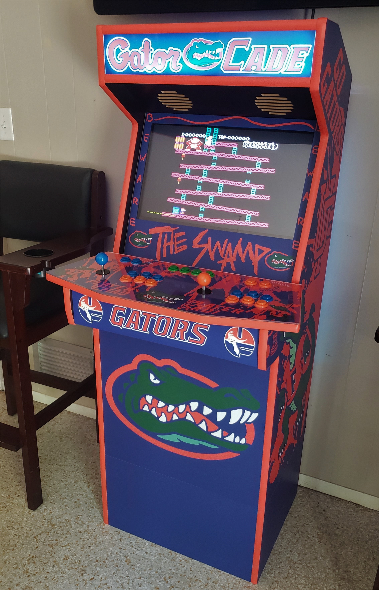
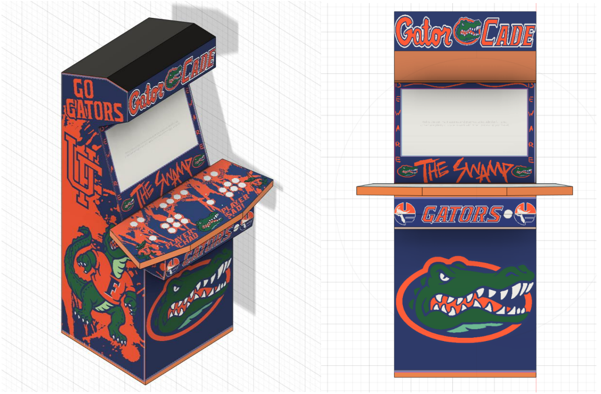
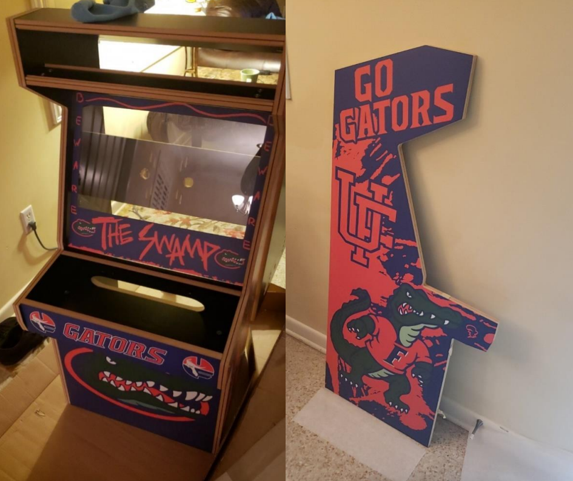
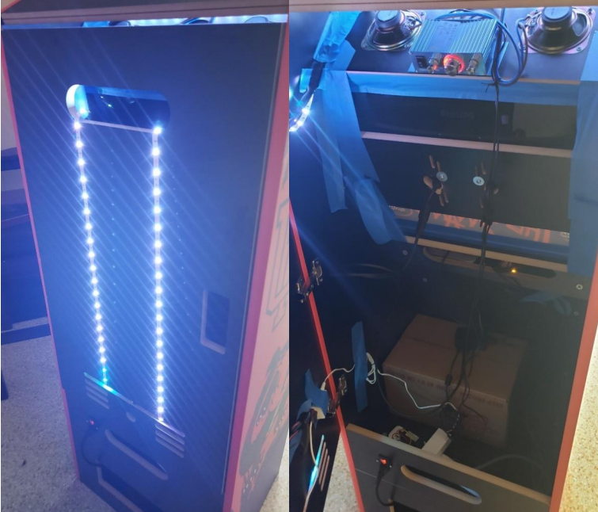

GatorCade: RetroPi Arcade Cabinet
==================================

  The finished cabinet, playing the NES version of Donkey Kong.

****************
Summary
****************

I built an arcade cabinet using a Raspberry Pi 3b running RetroPie on Emulation Station. The core system
can emulate retro games well with any USB input and HDMI output. However, the Raspberry Pi’s
hardware is best used for games using 2D graphics. In other words, the hardware works best with games
of the NES, SNES, and Arcade era of video games. This era of games is easily mapped to gamepad
controls as most titles require no more than 4 axis movement and a few buttons. Overall, the project
required two months from start to finish, as sourcing parts and the planning stage is key for a polished
result.

The purposes of this project:
    (1) Learn about the Linux environment
    (2) Apply basic circuit concepts
    (3) Reinforce soldering techniques
    (4) Have the end-user to have a video game emulator within an arcade cabinet.

****************
Tools
****************

* Soldering Iron, solder, and wick
* Box cutter
* Cordless drill
* Phillips’s screwdriver
* Wire strippers
* Rubber mallet
* Computer

****************
Materials
****************
 * `Prefab cabinet <https://gameroomsolutions.com/>`_
 * `Orange Cabinet T-molding <https://www.amazon.com/20ft-Roll-Plastic-T-Molding-Orange/dp/B07G7CBC2P>`_
 * Surge Protector
 * `Arcade cabinet Switch Socket <https://www.amazon.com/URBEST-Socket-Module-SwitchTerminals/dp/B07M9DJG53/ref=sr_1_2?dchild=1&keywords=switch+socket&qid=1630522042&s=electronics&sr=1-2>`_
 * `120V power cord <https://www.amazon.com/AmazonBasics-Power-Cord-12-FootBlack/dp/B072LPBVP7/ref=sr_1_5?dchild=1&keywords=120v+cord&qid=1630522106&s=electronics&sr=1-5>`_
 * `2 arcade sanwa Joysticks <https://www.amazon.com/SANWA-JLF-TP-8YT-Joystick-RedOriginal/dp/B08WWSX6JL/ref=sr_1_2?dchild=1&keywords=sanwa+joystick&qid=1630522121&s=electronics&sr=1-2>`_
 * `20 arcade buttons <https://www.amazon.com/EG-STARTS-American-StandardSwitchable/dp/B07GBRD4HJ/ref=sr_1_3?dchild=1&keywords=arcade+buttons&qid=1630522149&s=electronics&sr=1-3>`_
 * `Arcade 2 player controller microcontroller (Xin Mo) & Arcade wiring kit <https://www.microcenter.com/product/514043/xin-mo-co-xm-10-2-player-usb-to-arcade-controller>`_
 * `22in HD Monitor with VESA mounting <https://www.amazon.com/Philips-226E9QDSB-Frameless-1920x1080-FreeSync/dp/B07DMCLYHY/ref=sr_1_1?crid=2OY3JWWD5NJ2T&dchild=1&keywords=22in+monitor+vesa&qid=1630522339&sprefix=22in+monitor%2Caps%2C249&sr=8-1>`_
 * `Raspberry Pi 3b kit with power cord, case, and HDMI <https://www.amazon.com/CanaKit-Raspberry-Starter-PremiumBlack/dp/B07BCC8PK7/ref=sr_1_6?crid=1NK619MV3KIQK&dchild=1&keywords=raspberry+pi+3b+kit&qid=1630522370&sprefix=rasberry+pi+3b%2Caps%2C213&sr=8-6>`_
 * 128gb SD card (user choice for size)
 * `3.5mm audio cable <https://www.amazon.com/CableCreation-Auxiliary-Compatible-HeadphonesSmartphones/dp/B01ESINRAY/ref=sr_1_3?dchild=1&keywords=audio+cable+6ft&qid=1630522457&sr=8-3>`_
 * `12V 150W stereo audio amplifier <https://www.amazon.com/uxcell-Channel-Stereo-AmplifierMotorcycle/dp/B07BGYMTMT/ref=sr_1_6?crid=JT7VUNJK6DZN&dchild=1&keywords=150w+stereo+amplifier&qid=1630522475&sprefix=150w+stereo+%2Caps%2C189&sr=8-6>`_
 * `2 4” speakers <https://www.amazon.com/Coaxial-Vehicle-Stereo-FrequencySpeakers/dp/B07DDD971M/ref=sr_1_3?dchild=1&keywords=4+inch+speaker+arcade&qid=1630522514&sr=8-3>`_
 * `LED light strips <https://www.amazon.com/dp/B07YG67BZ7?ref=nb_sb_ss_w_as-ypp-romodel_ypp_ro_model_k0_1_4&crid=2V1P3ZHT5NS4T&sprefix=led>`_

****************
Preparation
****************

The first step of this process was to find a source for the cabinet of the machine. I was unable to
undertake a woodworking project of this magnitude at the time, so I found a company called
`Game Room Solutions <https://gameroomsolutions.com/>`_ who fabricates MDF cabinets for this specific purpose.
This company also offers vinylwrapping of their cabinets and allows customers to design their own wraps.
For this, I reached out to my brother to assist in the graphic design.
Together we designed a custom University of Florida Gators skin that came out beautifully.
I then took the vector images and designed the cabinet in Fusion360 to better visualize the custom wrap.
Upon sending the designs back to the company, I waited 2-3 weeks before receiving the product.

  CAD models with imported imagery used for the arcade cabinet.

After securing the cabinet, sourcing the internals was the next major step. The company
mentioned above offers everything needed at a premium. I sought other avenues to get the internals for
better price and customization of the Cabinet. This also let me acquire the Raspberry Pi faster and work
on setting up the emulator.

****************
Assembly
****************

Emulator Setup
----------------

Flashing a copy of RetroPie to a MicroSD card. This can be done in a variety of software, but I would suggest win32 disk
imager and the official Raspberry Pi imager for this task. Distributions of Linux specifically for Pi’s are
easily found when going to Raspberry Pi’s website, or with a quick google search.

The next step was adding games to the library, which I cannot tell you in detail.
This step was essentially copying files to specific game directories. There are many resources
for this if you look for them. After inserting the microSD into the Pi and doing some configuring with the
mouse and keyboard, I was set to start working on the full assembly.

Cabinet Assembly
------------------

Once the cabinet arrived, I started assembling the cam-lock cabinet, much like IKEA furniture.
This took a few days on-and-off to assemble, as there were no specific instructions
that came with the cabinet. The largest issues faced were in mounting the monitor within the
cabinet. This varies depending on the type of monitor used, as the HDMI port location changes between
models. The important part is to acquire a slim monitor with a VESA mount.

  Assembly of the Cabinet

After careful measurement and a few well-placed holes, the monitor was mounted, cables were run,
and gaps in the screen were covered with tape to reduce light
shining between the monitor and the front panel. The next step
was to add the T-molding to the entirety of the machine,
which required a precise cut to get the trim looking seamless.
Precision of this step creates a very professional touch.

Gamepad Wiring
------------------

When the base assembly was finished, insertion of buttons and joysticks were needed to complete
the exterior. Wiring of the joysticks is relative to the microcontroller, but a daisy chained Vcc line is sent
to every button that completes the circuit to the microcontroller GPIO (Figure 6). The Joystick is a bit
more complex with five wires for power and data transmission.

.. figure:: gatorcade_images/wiring.jpg
  :width: 600
  :align: center

  Wiring to the Joysticks and buttons to the microcontroller.

The microcontrollers used were Xin-Mo gamepad controllers, allowing simple controller inputs to be
received and sent to the Pi via serial communication. I used the one I found based simply by finding
a gamepad bundle that also included the buttons, wiring, and joysticks. Wiring was a tedious process but
incredibly rewarding. The microcontroller was then connected via mini-USB to USB on the Raspberry Pi.

Peripherals and Power
----------------------

Next was to finish off the internals. Sound, lighting, and power needed in the cabinet before
everything could be connected to the raspberry Pi. Sound of the system would be output from a 3.5mm
jack to a 12V 150W stereo amplifier for two speakers mounted on the system. LED light strips were
added to the arcade marquee as well as the back of the machine to add front and back lighting to the
system.

  Lighting, sound, power, and other internals to the Arcade Cabinet system. Painter’s tape is
  applied liberally to block marquee light from bleeding through the front panel.

A power strip with surge protection was added to the machine to power the monitor, lights,
amplifier, and Microprocessor. To control system power, a switch socket was added the back of the
cabinet and leads more effectively from the end of the power strip were soldered to the socket. A 120V
AC three prong power cord was then used to power the whole machine with a simple cutoff switch behind
the cabinet.

