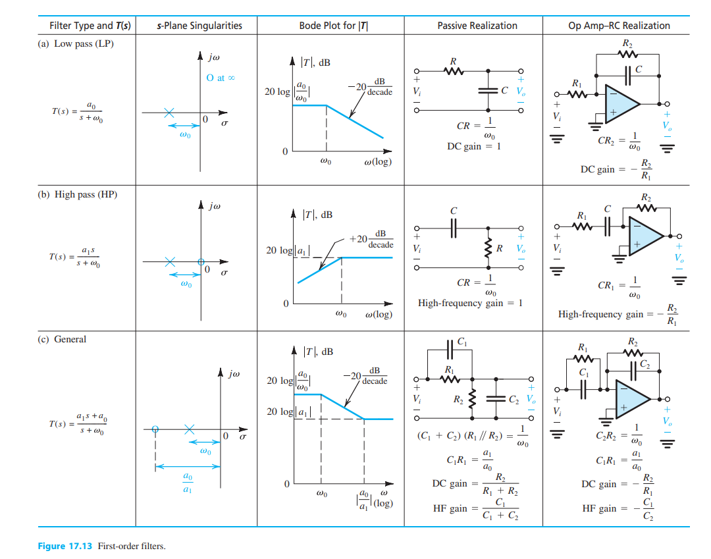

Active Filters
=====================================

First-Order Filter Theory
---------------------------

Analog filters are a method of reducing gain of responses at certain frequencies. First-order
filters implement a singular cutoff frequency while second order filters implement multiple
cutoff frequencies. Filters can be implemented in active and passive configurations, meaning
with and without Op-Amps respectively. Regardless of a filter being passive or active, Filter
frequencies and modes of operation are created between RL and RC components. Figure 1
implements passive and active filters in multiple filter configurations.

  First order filter table with active and passive applications [1]_.

Filter Responses: Butterworth, Bessel, and Chebyshev
------------------------------------------------------

Responses of real filters have three idealities in the form of Butterworth, Bessel, and Chebyshev filters.
Each focus on different characteristics with various tradeoffs, approximating an ideal response.
The filter with the flattest possible passband response is the Butterworth filter [2]_. Pulse and step responses
with a Butterworth filter have minor overshoot and ringing. Attenuation of the Butterworth filter is -20dB per pole.
The Butterworth filter is an overall well performing filter. The main drawback of a Butterworth filter is the large
transition region between the passband and the stopband.

.. figure:: reference/filter_response.png
  :align: center

  Magnitude Response and Step Response of Butterworth, Bessel, and Chebyshev filters [3]_.

Response of the Chebyshev filter has a steeper attenuation
compared to the Butterworth, with the disadvantage of overshoot and ringing in the passband [2]_. Chebyshev filters
have their cutoff at the point where the response falls below the ripple band. These filters are best for sharp
frequency filter cutoffs. In contrast, the Bessel filter has maximally flat time delay, with very little overshoot
and ringing. Bessel filters can preserve the wave shape of the original filter signal. The drawbacks of Bessel
filters are associated with its shallow attenuation and large transition region. Bessel filters are also not as flat
in its magnitude response as Butterworth filters.

Filter Realization: Sallen-Key Configuration
----------------------------------------------

The Sallen-Key is a popular topology for active filters configuration as it has the least dependence on
the Op-Amp performance. This is due to the Op-Amp being configured as an amplifier instead of an integrator [3]_.
The configuration also allows for ratio values for passive components are low, which is good for large-scale
manufacturing. However, the Sallen-Key is not easily tuned, which can be a serious drawback in choosing this topology.
The quality factor of the circuit will also impact gain of bandpass configurations. Sallen-Key is a great topology
if gain accuracy is important, a unity-gain filter is used, and the quality factor Q is low [2]_.

.. figure:: reference/sallen_key.png
  :align: center

  Sallen-Key Filter Configurations  [3]_.

Filter Realization: Multiple Feedback Configuration
-----------------------------------------------------

Another topology for composing filters is the multiple feedback configuration (MFB). This uses the Op-Amp as
an integrator, so it is more dependent on Op-Amp characteristics than the Sallen-Key configuration [3]_.
Ratios between maximum and minimum passive component values are larger than the Sallen-Key as well.
MFB is preferable due to its low sensitivity to variation in components. It is relatively easy to tune filter
characteristics [2]_. It should also be known that the MFB configuration inverts the signal, so pairs of two should
be employed to avoid output signal inversion.

.. figure:: reference/multiple_feedback.png
  :align: center

  Multiple Feedback Filter Configurations [6].  [3]_.

**References**

.. [1] A. S. Sedra, K. C. Smith, T. C. Carusone, and V. Gaudet, “Chapter 2: Operational
    Amplifiers,” in Microelectronic circuits, New York, NY: Oxford University Press, 2021,
    pp. 60–73.

.. [2] “FilterPro™ user's Guide - Ti.com,” Texas Instruments, Feb-2011. [Online]. Available:
    https://www.ti.com/lit/an/sbfa001b/sbfa001b.pdf. [Accessed: 14-Nov-2022].

.. [3] H. Zumbahlen, “Chapter 8: Analog Filters,” in Linear Circuit Design Handbook, Oxford:
    Newnes, 2008.
