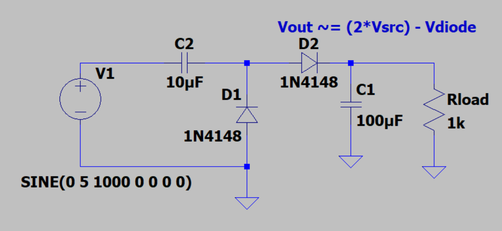

Circuit Applications
=====================================

Charge Pumps
--------------------------

  Positive voltage charge pump.

A charge pump is a circuit that uses a periodic signal and diodes to force charge buildup on a capacitor.
While this is an effective way to store an energy potential, the voltage will approach the peak-to-peak voltage
unless dissipated on a load or regulated. The size of the capacitors and the frequency of the input waveform
will determine the time it takes for the circuit to charge.

.. figure:: reference/neg_charge_pump.png
  :align: center

  Negative voltage charge pump.

Negative voltage rails are often needed for reference voltages and are a useful addition to many circuit designs.
An easy approach for low current applications could rely on a negative charge pump.

An H-bridge is a circuit configuration consisting of four transistors, primarily MOSFETs or BJTs configured in an
H pattern. Each side of an H-bridge has a complementary set of transistors where only one transistor on each side
is active at a given time. If two transistors on one side are on, a short circuit will occur as the attached
transistor try and source and sink as much current as possible. During normal operation, current flows through
an attached device in one of two directions.

  H-Bridge circuit and current paths [1].

The circuit essentially acts as an alternating set of switches so that the current flow or polarity may be swapped
on a device. H-bridges are commonly used for motor drivers because of their ability to swap polarity, allowing
forward and reverse motion control. Braking and coasting configurations are also available for abrupt or natural
decaying stops respectively. H-Bridge circuits can be made discretely or be found in integrated packages often
with driver circuitry included. Driver circuitry simplifies the process of controlling an H-bridge and insures
safe operation. Often, H-bridge drivers only require static digital values or a PWM signal to change the
average voltage and current applied.

.. figure:: reference/discrete_h_bridge_driver.png
  :align: center

  Discrete H-bridge driver solution [2].

**References**

.. [1] Texas Instruments. "DRV8871 3.6-A Brushed DC Motor Driver with Internal Current." [Online].
       Available: [www.ti.com/lit/ds/symlink/drv8871.pdf].

.. [2]  P. Horowitz and W. Hill, "The Art of Electronics." Cambridge University Press, 2022.

