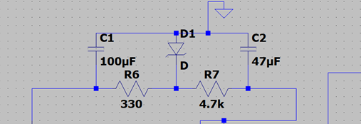
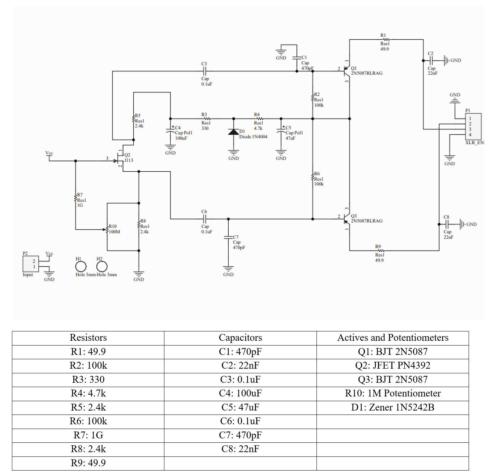
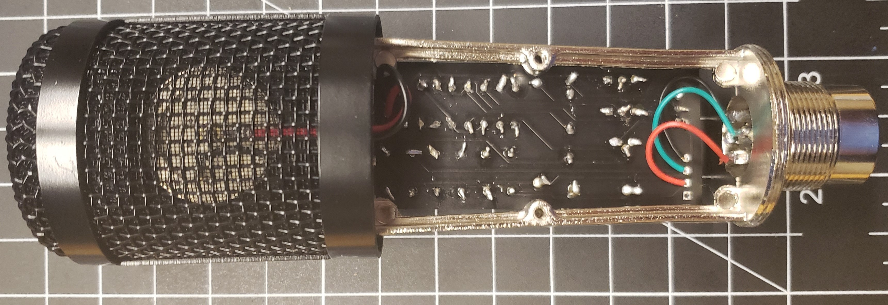

Condenser Microphone Workshop
====================================================

  Finished Microphone.

******************************
Introduction and Objectives
******************************

The purpose of this project is to
    (1) explain electronic circuit concepts relating to FET’s and BJT’s
    (2) review basic circuit concepts
    (3) reinforce soldering techniques
    (4) the end user to have a quality condenser microphone.

The lab consists of ordering necessary components from the attached parts list, removing the
internals of a donor microphone, Soldering circuit components to the microphone, testing, and tuning.

******************
Design Theory
******************

Microphone Capsule and JFET
------------------------------

A condenser microphone operates with a device called an electret capsule. Electrets act very similar to a capacitor,
giving condenser microphones the alternate name of capacitor microphones. Capsules have a fixed backplate side and a
diaphragm side that can vibrate due to sound waves. This vibration causes a difference in the distance between the
plates, changing the capacitance and therefore the voltage across the capacitor.

  Capacitor physics equations.

Electret diaphragms can be a thin metal, or mylar covered with a metal coating. A gold coating is often found in
high-end equipment due to its corrosion resistivity. The TSB-2555 capsule has a Nickel coating and is adequate for
our purposes. Electret capsules also have a static bias applied when manufactured, due to the dielectric between the
plates. This allows for the capsule to run on low power circuits. Before this, condenser microphones required a
polarizing voltage between 60-80V to develop signals from the microphone capsule. Biased electret capsules like
the TSB-2555 do not require a polarizing voltage. In our case, a 5V source from a PC USB port is used to power the
microphone using an audio interface that transforms the voltage to 48V for phantom power.
Phantom power is simply a DC offset applied to the signal line for analog circuitry, and while the standard is 48V,
can range from values from 12V to 48V.

  Electret Capsule anatomy and wiring diagram.

Unlike most electret capsules, the TSB-2555 Electret capsule does not have an internal JFET, similar to the one
seen on the right-hand side of figure 2. Therefore, we must include this component in our circuitry to develop a signal.
This is the impedance converter and phase splitter of the circuit, allowing for the high Impedance capsule signal to
control a low impedance output. For those who have little experience with transistors, think of the JFET as a
voltage-controlled resistor, in which sound waves control the resistance via the capsule. The JFET mimics the signal
from the capsule, allowing flow of the current from the drain and source corresponding to the waveform at the gate.
The 1GΩ Resistor biases the JFET, finding a path to ground. This puts the JFET in the same operating region upon
startup and helps develop the capsule signal. A low-pass filter is also being created between the capsule capacitor
and resistor, limiting noise developed by the capsule. If you are interested in the capacitance of the capsule,
there is a link to the disassembly and testing of the TSB-2555 in the appendix.

  Input section of the circuit. Electret Capsule JFET wiring diagram.

  Time constant and cutoff frequency equation.

The 1M potentiometer that is connected to the 1Gigaohm resistor applies tuning this filter by adding resistance in
series to the development of the signal.Identical load resistors are applied to the source and drain of the FET,
creating a phase splitter. The source of the FET contains identical voltage to the gate, while the voltage drop from
source to drain creates a halved amplitude and opposite polarity. There is a total voltage gain factor of ~1/2 due
to this. Signals are then sent to the BJT’s through coupling and smoothing capacitors. (Figure 5)

  Microphone input stage. A focus on the identical 2.4k load resistors and AC coupling/smoothing capacitors.

Output and Signal Transmission
--------------------------------

The output stage is composed of passive lowpass filters on the XLR signal wires.Two PNP BJT’s compose emitter
followers for buffered outputs to the XLR connector. These BJT’s provide low output impedance for transmission
to the Pre-amp or audio interface. As expected with a BJT, there is about a 0.7V DC drop across the base and emitter.

.. figure:: fet_mic_images/image006.png
  :align: center

  Microphone output stage. A focus on the lowpass filters and the Bipolar BJT’s setup in an emitter follower configuration.

Power
------------------

The power stage of the circuit takes the phantom power potential of the XLR. XLR transmits balanced analog signals
in a differential mode. This means that the signals pins XLR 2 and 3 are equal and opposite waves, with a DC offset
equal to the Phantom power voltage. Equal 100k resistors then act as a voltage averaging mechanism to isolate the DC
offset for further use it the power system. A variety of components work together in stepping down, stabilizing,
and cleaning the voltage to a DC value in the range of 10-12V. This cleaned voltage goes to the 2.4k resistor into
the input stage. The capacitors provide a smoothing to the voltage, while the Zener diode steps down and regulates
the voltage. This is also known as a Zener diode regulator. The output filter creates a low pass with a cutoff of ~5Hz,
limiting noise on the DC voltage.

  Microphone power stage. A focus on the Zener regulator and RC filters.

******************
Assembly
******************

Capsule Swap
------------------

Start disassembly by unscrewing the microphone bottom to reveal the internal components.
Remove the two screws that connect the capsule wire shield to the chassis to reveal the electret capsule.
Unsolder the connecting wire of the existing capsule. After, unscrew the capsule holder to remove the capsule from the
microphone chassis. Carefully cut the plastic of the capsule holder to remove the original small capsule.
This action is best done with a set of diagonal cutters. Trim down any excess plastic within the capsule holder
to better fit the new electret capsule. Once the capsule holder is augmented, insert the new electret capsule,
and set it in place with a small amount of hot glue. If you are having trouble fitting the new capsule into the
capsule holder, try trimming down the holder more. If it still does not fit, carefully cut out a slice of the capsule
ring to expand the capsule holder to better fit the new capsule. When you have the new capsule set into the capsule
holder, screw the capsule holder back into the chassis, making note of which screw holes are threaded.
Resolder the existing capsule wires to the new electret capsule, with the signal wire going to the center
tab of the capsule and the ground wire going to the edge of the capsule.

PCB Swap
------------------

Unsolder the wire ends that are attached to the existing board. Start with the capsule wires,
then work your way down to the XLR wires. Some boards label the XLR wire ends, others do not,
so to best connect your XLR jack to the new board, compare the XLR connections to the figures below
and Resolder with new wires if the color code of your existing wires is too confusing.
After this, unscrew the existing board and set the chassis aside.

  Female XLR jack connections.

PCB Soldering
------------------

Solder the new components to the PCB. I recommend Soldering All Passive components first but it could be done in
any order.

  Microphone Schematic and component table for creation of a Printed Circuit Board.

******************
Results
******************

  Finished Microphone.

  Reverse side of the Finished Microphone.

******************
Appendix
******************

Parts List
------------------

`Mouser active and passive parts  <https://www.mouser.com/ProjectManager/ProjectDetail.aspx?State=EDIT&ProjectGUID=f74b44ec-a300-4a63-ad8d-b5751556b5cd>`_

`Base microphone for shell ~$15-30 (search for BM800 on Amazon) <https://www.amazon.com/ZINGYOU-Condenser-Microphone-Cardioid-Recording/dp/B075MX6SGX/ref=sr_1_13?crid=1U0EWKZ1UK6IE&dchild=1&keywords=bm+800+microphone&qid=1635268936&sprefix=bm800%2Caps%2C83&sr=8-13>`_

`TSB-2555B electret capsule $13 plus shipping <https://www.jlielectronics.com/microphone-capsules/jli-2555bxz3-gp/>`_

Audio Interface Recommendations
--------------------------------

  .. note:: You will need an interface/Phantom power supply of some sort as the circuit is designed for 48V phantom power.
   Here are some recommendations at different price points if you not already own one.
   You will need a Female to Male XLR cable as well.

`Behringer UM2  <https://www.amazon.com/BEHRINGER-Audio-Interface-1-Channel-UM2/dp/B00EK1OTZC>`_

`Scarlett 2i2  <https://www.sweetwater.com/store/detail/Scarlet2i2G3--focusrite-scarlett-2i2-3rd-gen-usb-audio-interface>`_

`SSL2  <https://www.sweetwater.com/store/detail/SSL2Plus--solid-state-logic-ssl2-usb-audio-interface>`_

Reference Material
--------------------

`What is a condenser microphone?  <https://mynewmicrophone.com/what-is-a-condenser-microphone-detailed-answer-examples/>`_

`Microphone wikipedia page  <https://en.wikipedia.org/wiki/Microphone>`_

`Basic FET microphone circuits  <http://www.audioimprov.com/AudioImprov/Mics/Entries/2015/4/23_Basic_FET_Microphone_Circuits.html>`_

`Mic Circuits in detail <http://www.audioimprov.com/AudioImprov/Mics/Entries/2021/2/5_Circuits_-_Simple_to_Professional.html>`_

`Zener Noise  <http://www.audioimprov.com/AudioImprov/Mics/Entries/2021/1/17_Zener_Noise.html>`_

`TSB2555 Capsule dismantling <https://www.firstpr.com.au/rwi/mics/2009-09-a/>`_

`Microphone instructables <https://www.instructables.com/Modify-a-cheap-LDC-Condenser-microphone/>`_

