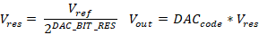

Data Conversion: ADC and DAC Theory
=====================================

***********************************
ADC - Analog to Digital Conversion
***********************************

Analog to Digital Converters are the primary method of capturing analog data using a
microcontroller. ADC’s capture analog signals such as sound or light waveforms and convert
them to a digital signal for processing of information. An ADC takes continuous magnitude data
from a continuous time domain into discrete magnitude data in a discrete time domain [1]_. The
conversion quantizes the signal based on the resolution, reference voltages, and sample rate of
the ADC, introducing small errors into the signal as noise.

.. figure:: theremin_images/image002.png
  :align: center

  Quantization of an Analog to Digital Converter on a sine wave.

Resolution and reference voltages of an ADC produces quantization errors within the
amplitude domain of a signal, where the sample rate of an ADC produces quantization errors
within the time domain. Resolution gives the number of discrete values an ADC can produce,
where the reference voltages provide the span of voltages the ADC can receive as a signal.
Ground is often defaulted to the lower reference voltage to simplify ADC implementation. As a
result, the voltage resolution in volts per bit is given as the span between the reference voltages
divided by the number of discrete values the ADC resolution can produce. The digital code made
by the ADC multiplied by the voltage resolution of the ADC will return the voltage recorded by
the ADC. Quantization produces rounding errors in the approximation of the analog voltage,
which is worsened by noise and jitter that exists on the signal prior to the ADC conversion.
Signal noise can significantly reduce the effective number of bits to which an ADC is accurate.

  ADC formulas.

Sample rate of an ADC produces quantization errors within the time domain of the
signal. The sampling rate of an ADC should ideally greater than twice the highest frequency
being recorded, otherwise aliasing will occur. Aliasing can also be mitigated by adding a low-pass
filter to the ADC input, removing frequencies above half of the sampling frequency.
Oversampling is also commonly employed as it can reduce noise and improve bit-depth.

***********************************
DAC - Digital to Analog Conversion
***********************************

A Digital to Analog Converter operates on much of the same principles of an ADC but in
reverse. DAC’s take a digital code that is within the resolution range of the device and output an
analog waveform. Uses for DAC’s are often found in creating audio and video signals [2]_. A
DAC will have a singular or pair of voltage references and a bit resolution for characterizing the
precision and range of the output waveform. An output voltage can be calculated by dividing a
given code by the number of discrete values the DAC can produce. This is then multiplied by the
reference voltage to return the ideal output voltage.

  DAC formulas.

DAC’s have some non-idealities in the form of differential and integral non-linearity,
which characterize the difference between two adjacent code values and the difference in the
transfer characteristic, respectively.

**References**

.. [1] “Analog-to-digital converter,” Wikipedia, 09-Oct-2022. [Online]. Available:
    https://en.wikipedia.org/wiki/Analog-to-digital_converter. [Accessed: 19-Oct-2022].

.. [2] “Digital-to-analog converter,” Wikipedia, 13-Jun-2022. [Online]. Available:
    https://en.wikipedia.org/wiki/Digital-to-analog_converter. [Accessed: 19-Oct-2022].