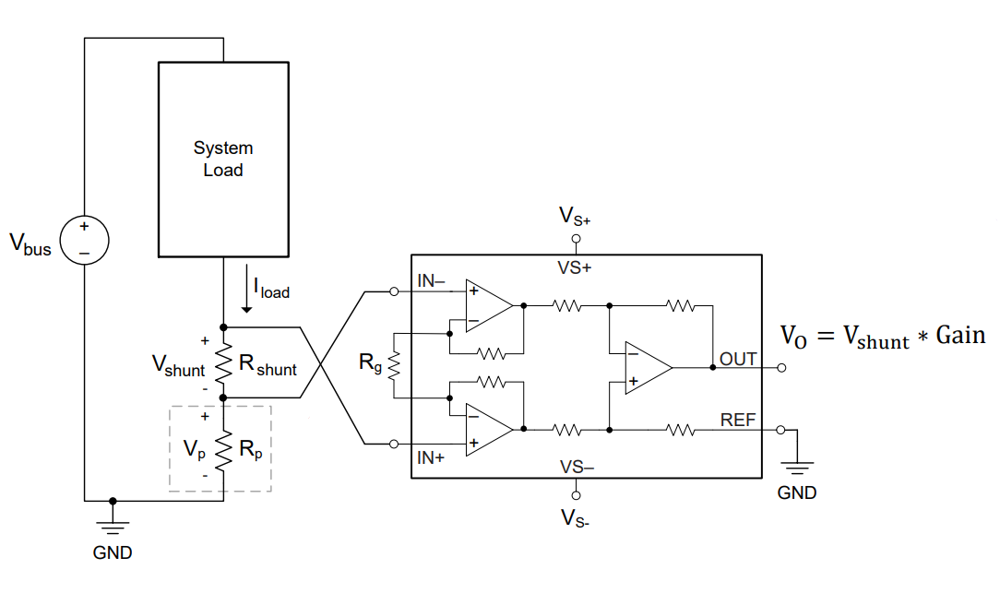
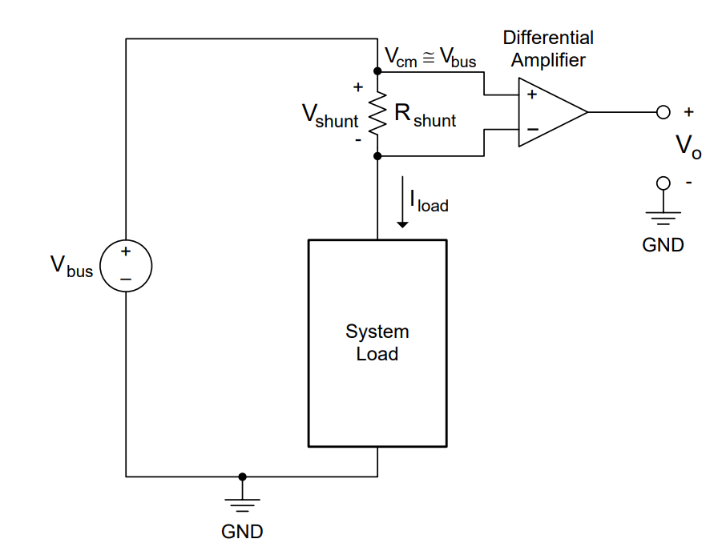
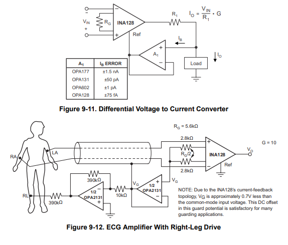
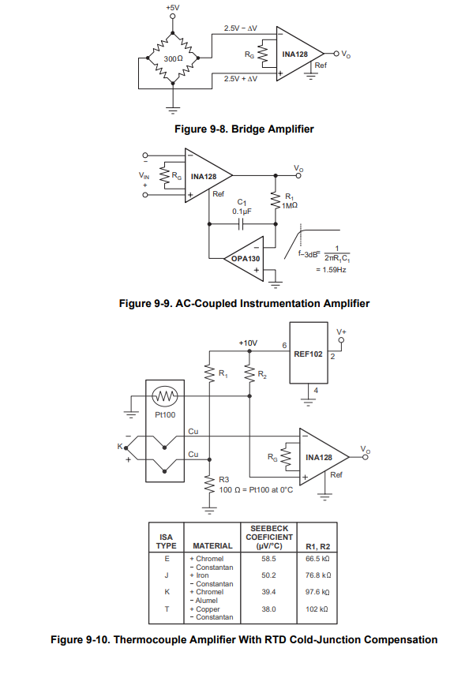

Instrumentation Amplifiers
=====================================

*******************
Theory
*******************

.. figure:: reference/instrumentation_amp.png
  :align: center

  The classic instrumentation amplifier circuit [2]_.

Instrumentation Amplifiers (INA) are an improvement on the differential amplifier for applications needing high input
impedance, gain, CMRR, and low noise. They work on the principle of taking an existing differential amplifier and
adding non-inverting amplifiers to the differential input. By adding resistor Rg, gain can be applied to the
differential signal. If the gain resistor is omitted, the input amplifiers become voltage followers and the gain
of the system is 1. High CMRR and low noise is only available when a large gain is applied, as Rg scales the signal to
noise ratio of the input stage and diminishes reliance on U3 for common mode rejection.

*******************
Applications
*******************

Current Sensing
------------------------

  Low-side current sensing with Instrumentation amplifier and equation [3]_.

Instrumentation amplifiers are prime candidates for current sensing devices for their low noise, high impedance,
and high gain properties. Shunt current sensing requires observing a differential voltage across a known resistance
somewhere within a circuit loop. Using Ohm’s law and the gain of the instrumentation amplifier, you can easily
calculate current through the known shunt resistance. The configurable gain of the instrumentation amplifier
makes the circuit versatile for a variety of shunt resistances. The high input impedance also allows for very
small currents to be measured [1].

  High-side current sensing with a differential amplifier [3]_.

Generally, a sense resistor is connected between the load and ground for low-side sensing, or between the supply
and load for high-side sensing. There are advantages and disadvantages to both high and low side current sensing.
Low side sensing is easier to implement, inexpensive, and can be implemented with a single-ended configuration.
However, this setup removes direct access to ground and cannot sense shorts. High-side current sensing fixes
issues seen from the previous method but creates entirely new ones in the process. Sensing from the high
side no longer disconnects ground and allows for short circuit detection. However, the device will be working
at higher potentials and can have a significant voltage swing depending on the load and source voltage.

Further applications
------------------------

  Applications of the INA128 Instrumentation Amplifier [1]_.

Instrumentation amplifiers are fantastic devices for applications requiring observation of a signal without
disturbing it. However, they are costly devices compared to a typical op-amp, and the INA circuit is hard to
recreate off chip without matched pair components. Features such as CMRR and noise reduction would be lost as
a result. ADCs, balanced audio, current sensing, and electrocardiography (ECG) machines are some of the many
applications that utilize the benefits of instrumentation amplifiers.

  More Instrumentation amplifier circuits [1]_.

**References**

.. [1] “INA128 Datasheet,” Analog | Embedded Processing | Semiconductor Company | ti.com. [Online]. Available:
    https://www.ti.com/lit/ds/symlink/ina128.pdf. [Accessed: 13-Mar-2023].

.. [2] P. Horowitz and W. Hill, “Chapter 5: Precision Circuits,” in The Art of Electronics, New York: Cambridge
    University Press, 2022.

.. [3] “Current Sensing with  Different Types of  Amplifiers,” Current sense amplifiers | TI.com, 05-Jun-2020.
    [Online]. Available: https://www.ti.com/video/series/ti-precision-labs-current-sense-amplifiers.html.
    [Accessed: 14-Mar-2023].
