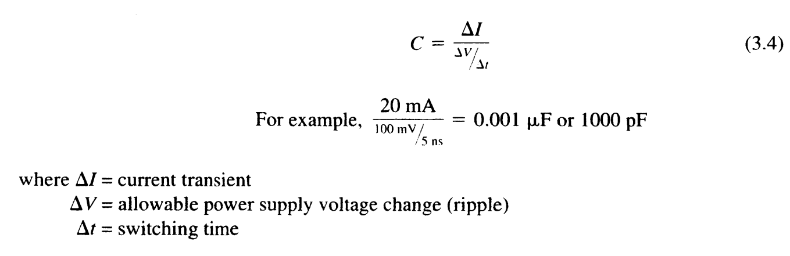
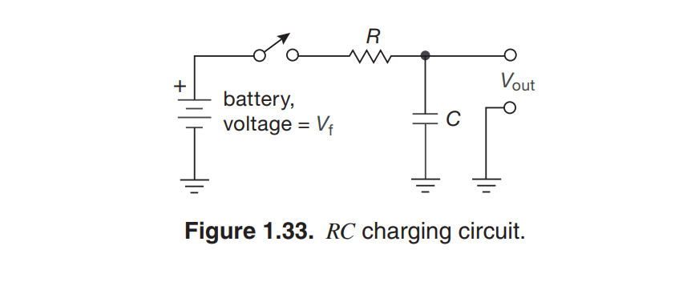
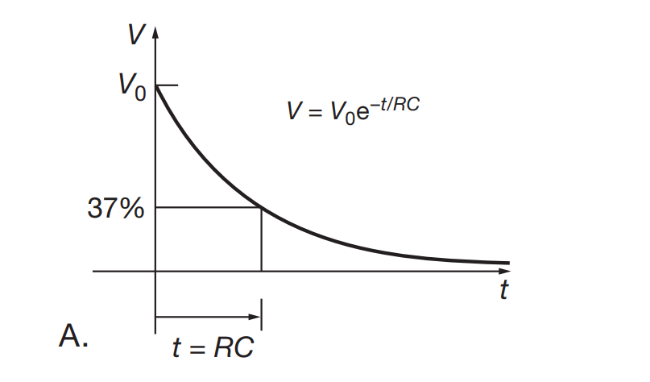
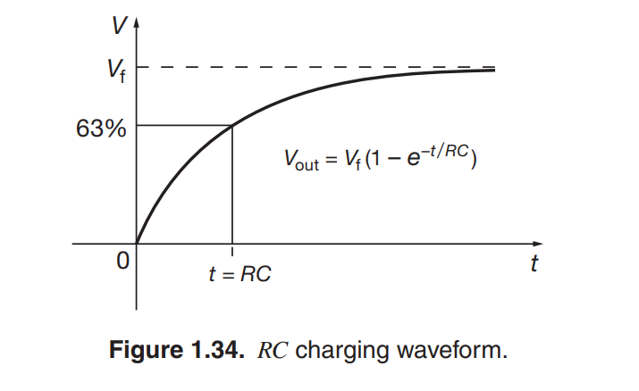
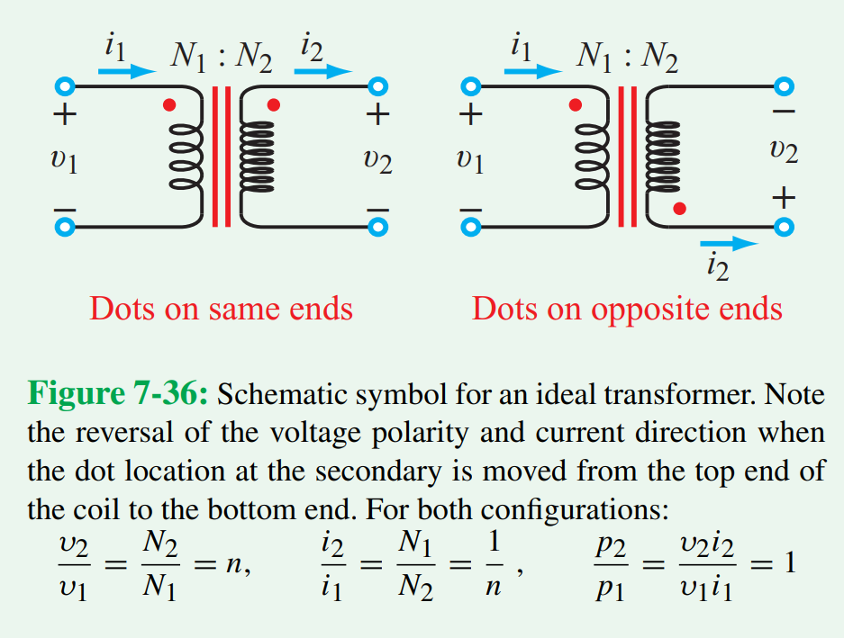

Passive Components
=====================================

******************
Capacitors
******************

Capacitors are passive electrical components that store energy in the electric field. They can be used for a variety
of roles such as filters, timers, short term energy sources, or even to separate DC and AC signals.

Capacitors are essentially two conductive metal plates surrounding a non-conducting region or dielectric.
The metal plates have an area **A**, a distance between **d**, and a dielectric permittivity **ε**. A capacitor of C
Farads with V volts across it's terminals has Q coulombs stored on a plate and -Q on the other [3]_

.. math:: C = \frac{Q}{V} = \epsilon_0\frac{A}{d}

By taking the derivative of the above equation, you can see that current through a capacitor is equal to the capacitance
times the derivative of voltage with respect to time. Capacitors resist change in voltage, and are primarily used for
filtering, bypassing, and coupling.

.. math:: (Q)dt = (CV)dt = I = C\frac{dV}{dt}

Coupling
---------------------------------

Consider having an Ideal DC voltage of 5V with no change over time, this would mean that the dV/dt term would be zero,
making current through the capacitor zero. This essentially creates an open circuit for a DC or low frequency signals.
An alternating signal of higher frequency would be allowed to pass, creating a nonzero dV/dt term and therefore current.
When a capacitor is used in a signal path, this is called blocking or **coupling**. This can be used to block a DC
voltage from one part of a circuit to another [3]_.

Decoupling and Bypass
---------------------------------

Alternatively, when a Capacitor is placed from a DC node to ground, this is referred to as a **decoupling** or
**bypass** capacitor [4]_, [5]_. Decoupling and bypass capacitors have slightly different reasons for use, but are
practically synonymous. A bypass capacitor prioritizes removal of unwanted high frequency noise from a node on the
circuit since it acts as low impedance (a short) for high frequencies. Bypass caps may also create an RC filter.

Decoupling usually avoids AC ripple, noise, and overall voltage discontinuities that can occur in a voltage rail.
Capacitors used for decoupling are generally next to a device or IC to clean up voltage used for power or reference.
In the application of decoupling, a capacitor is added to remove voltage ripple caused by a transient current load.
If you have a microprocessor that suddenly requires a surge in current, an decoupling capacitor will minimize voltage
ripple based on the current required, time of the surge, and capacitance.

  Decoupling capacitor equation for minimizing voltage ripple caused byt a transient current [2]_.

Application Note: Rectification Filtering
*******************************************

.. note::

    After rectification, filtering capacitors must be applied to create steadier DC voltages. Filtered voltages are
    around the potential seen at the peak of rectifier output with ripple caused by capacitor charging and discharging.
    Large capacitances are needed at this step to reduce voltage ripple under transient loads. The larger the capacitance
    of the decoupling capacitor, the smaller the output voltage ripple under steady load. This is because the decoupling
    capacitors act as energy storage during the charging phase, and an energy source during the discharging phase.
    Using the decoupling capacitor formula along with device operation specifications, a capacitance suitable to the
    use case can be determined.

    .. figure:: reference/rectifier_and_filter.png
      :align: center

      Filtered output of a full bridge rectifier [1]_.

Parallel and Series Capacitors
-------------------------------

Capacitors in parallel have the sum of their individual capacitances [3]_.

.. math:: C_{tot} = C_1 + C_2 + C_3 + ...

Capacitors in series have formulas similar to resistors in parallel.

.. math:: C_{tot} = \frac{C_1 * C_2}{C_1 + C_2}

.. math:: C_{tot} = \frac{1}{\frac{1}{C_1} + \frac{1}{C_2} + \frac{1}{C_3} + ...}

Time Domain RC circuit
------------------------------

  RC Charging and Discharging Circuit [3]_.

Given an RC circuit, a time constant will be created as the product of the resistance and capacitance.

.. math:: \tau = RC

RC circuit charging and discharging occurs at an exponential decay based on the time constant. This is most easily seen
in discharging, where the output voltage is the initial voltage times the exponential decay function of time. In the
case of charging, the output is equal to the final voltage times the inverse of the exponential decay function of time.

  Voltage over time of circuit discharging. [3]_.

  Voltage over time of circuit charging. [3]_.

******************
Inductors
******************

Similar to Capacitors, Inductors are passive components that store energy in a circuit. However, Inductors store energy
in the magnetic field. and the rate of current change in an inductor is proportional to the voltage across it [3]_.
The unit for inductance (L) is called Henrys H.

.. math:: V = L\frac{dI}{dt}

Real life inductors have a variety of non-idealities which makes most cases favor the more ideal capacitor. That being
said, inductors have interesting applications.

Transformers
------------------------------

  Ideal transformer model and equations. [1]_.

A transformer consists of two coupled inductors, often called primary and secondary windings. While both windings
are electrically isolated, they can transfer energy through the magnetic field. An AC voltage applied to the primary
winding will appear on the secondary proportional to the turns ratio between the windings. Current is inversely
proportional to the turns ratio. Power is mostly conserved, as transformers are incredibly efficient. Power
transformers are often used to step down voltages from a household 120AC outlet to a more useful voltage level [3]_.

**References**

.. [1] F. T. Ulaby, M. M. Maharbiz, and C. Furse, “7-12 Application Note: Power-Supply Circuits,” in Circuit analysis
    and Design, Ann Arbor, MI: Michigan Publishing, 2018, pp. 432–437.

.. [2] M. I. Montrose, “Chapter 3: Bypassing and Decoupling,” in Printed circuit board design techniques for
    EMC Compliance: A handbook for designers, Wiley IEEE Press Imprint, 2000, p. 70.

.. [3]  P. Horowitz and W. Hill, “Chapter 1: Foundations,” in The Art of Electronics, New York:
        Cambridge University Press, 2022.

.. [4] “What is a bypass capacitor? tutorial: Applications,” Electronics Hub, 14-Sep-2021.
    [Online]. Available: https://www.electronicshub.org/bypass-capacitor-tutorial/. [Accessed:
    27-Aug-2022].

.. [5] “What is a Bypass Capacitor?,” What is a bypass capacitor? [Online]. Available:
    http://www.learningaboutelectronics.com/Articles/What-is-a-bypass-capacitor.html.
    [Accessed: 27-Aug-2022].

